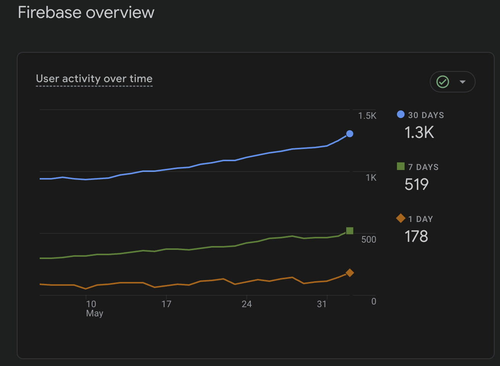

# Tutor
---

## English

Tutor is an Android app for building personal test banks, practicing with multiple test modes, and
tracking progress over time.

The project is built with Kotlin, Jetpack Compose, Room, Koin, and a custom MVI-style presentation
layer split across three modules:

- `:app` — application layer, screens, ViewModels, repositories, DI modules
- `:database` — Room database, entities, DAOs, migrations
- `:common_ui` — reusable UI components, theme, state helpers, MVI base classes

### Main capabilities

- Create and manage tests
- Add, edit, and delete questions with single or multiple correct answers
- Run tests in `Exam` and `Workout` modes
- Review incorrect answers and maintain a favorites list
- Store attempts and aggregate user statistics locally
- Import tests from JSON files
- Schedule local reminder notifications
- Support Google Play and RuStore review flows

### Tech stack

- Kotlin 2.1.21
- Jetpack Compose + Material 3
- Koin 4
- Room 2.7
- Navigation 3
- WorkManager
- Gson + Kotlin Serialization

### Build

```bash
./gradlew assembleGoogleDebug
./gradlew assembleRustoreDebug
./gradlew test
```

### Sample JSON tests

You can use these ready-made JSON files to verify the import flow and test behavior on different
dataset sizes:

- [Coroutines test](https://drive.google.com/file/d/1gyto8t4jjlpRq4mjCRtTOPKPmMH3i4fz/view?usp=drive_link)
- [1,000-question test](https://drive.google.com/file/d/1WRJ7jgaePfCe-lfNZgmhNgCpW_5ifDjZ/view?usp=drive_link)

### Documentation

[Architecture](docs/en/architecture.md),
[Functionality](docs/en/features.md),
[Screens](docs/en/screens.md),
[Data Model](docs/en/data-model.md),
[Dependency Injection](docs/en/dependency-injection.md),
[Dependencies](docs/en/dependencies.md),
[Testing](docs/en/testing.md),
[UI Guidelines](docs/en/ui-guidelines.md)

---

## Русский

Tutor — Android-приложение для создания и прохождения тестов

Проект написан на Kotlin с использованием Jetpack Compose, Room, Koin и MVI. Код разбит на три
модуля:

- `:app` — экраны, ViewModels, репозитории, DI-модули
- `:database` — Room, Entity, DAO, миграции
- `:common_ui` — переиспользуемые UI-компоненты, тема, вспомогательные классы MVI

### Основные возможности

- Создание тестов
- Добавление, редактирование и удаление вопросов с одним или несколькими правильными ответами
- Прохождение тестов в режимах `Экзамен` и `Тренировка`
- Просмотр ошибок и ведение списка избранного
- Импорт тестов из JSON-файлов
- Планирование локальных уведомлений-напоминаний

### Технологический стек

- Kotlin 2.1.21
- Jetpack Compose + Material 3
- Koin 4
- Room 2.7
- Navigation 3
- WorkManager
- Gson + Kotlin Serialization

### Сборка

```bash
./gradlew assembleGoogleDebug
./gradlew assembleRustoreDebug
./gradlew test
```

### Примеры JSON-тестов

Готовые файлы для проверки импорта тестов в формате JSON:

- [Тест по корутинам](https://drive.google.com/file/d/1gyto8t4jjlpRq4mjCRtTOPKPmMH3i4fz/view?usp=drive_link)
- [Тест из 1000 вопросов](https://drive.google.com/file/d/1WRJ7jgaePfCe-lfNZgmhNgCpW_5ifDjZ/view?usp=drive_link)

### Документация

[Архитектура](docs/ru/architecture.md),
[Функциональность](docs/ru/features.md),
[Экраны](docs/ru/screens.md),
[Модель данных](docs/ru/data-model.md),
[Внедрение зависимостей](docs/ru/dependency-injection.md),
[Зависимости](docs/ru/dependencies.md),
[Тестирование](docs/ru/testing.md),
[UI-гайд](docs/ru/ui-guidelines.md)

---
Статистика Firebase 03.06.26


